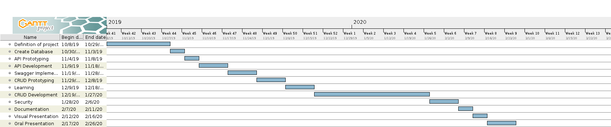

# Java CRUD Project

## Project conception

### 1. Technical choices

This project will be divided in 3 parts :

* HMI (**H**uman **M**achine **I**nterface)
* API (**A**pplication **P**rogramming **I**nterface)
* Database

#### IHM
_____

In order to choose the best matching language for our solution, we made a decision-making matrix. Based on our requirements, we assigned scores to the technologies we would like to use depending on the criterias.

With this matrix, we decided to use **Java** for this project. Actually, it is a very popular language for professional use and it has the advantage to be very scalable because of the JVM (**J**ava **V**irtual **M**achine).
It is also very powerful, secure and much efficient to make transaction on a database.

Linked with this language, we will use **Swing** to build a GUI (**G**raphic **U**ser **I**nterface), which is a widely used library, tried and tested many times.

#### API
_____

Concerning the API, it will be realised in **NodeJS**. Indeed, this framework help us to build an efficient API, with sufficient performances.

The huge community and the amount of libraries available convinced us to use this technology.

#### Database
_____

For the database, we will use **MySQL** because of its capacity to handle small volumes of data, which will match with the volumee of data of our solution.

-----

### 2. Project management

In order to manage this project, we use a tool called [ClickUp](https://app.clickup.com/). Similar to [Trello](https://trello.com), it allow us to set tasks, priorities and deadlines to project milestones and manage them.

It is useful to centralize all of the 'to-do".

Code versioning is handle by [Github](https://github.com), which now allow us to create private repositories up to 3 users.

A shared folder is also accessible on [Google Drive](https://drive.google.com) to make more easy the sharing of all the project related files.

Communication inside the groupe team is essentially achieve by Telegram, which is an End-to-end encrypted instant messaging system.

#### Gantt Diagram

To have a global view of the project advancement, we made a Gantt diagram.

A similar view is available on ClickUp

